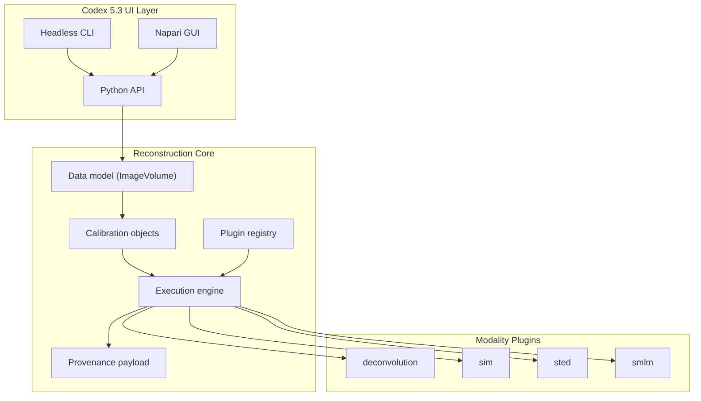

# Codex 5.3 Reconstruction Integration

This document captures the implemented Phase 1 integration for a modular reconstruction suite.

## Enforced Principles

1. One shared reconstruction core:
- plugin interface, execution engine, and provenance are centralized in `pymaris.reconstruction`.
- modality modules do not reimplement orchestration and logging plumbing.

2. Explicit calibration objects:
- calibration inputs are represented as typed artifacts (`CalibrationArtifact`, PSF/OTF/SIM/SMLM models).
- SIM/STED/SMLM plugins validate required calibrations before execution.

3. Licensing isolation:
- external GPL tool integrations are modeled as optional subprocess adapters (`ExternalToolAdapterSpec`).
- core package remains independent of GPL runtime dependencies.

## Implemented Architecture

## Key Modules

- `src/pymaris/reconstruction/types.py`
- `src/pymaris/reconstruction/calibration.py`
- `src/pymaris/reconstruction/plugin.py`
- `src/pymaris/reconstruction/registry.py`
- `src/pymaris/reconstruction/engine.py`
- `src/pymaris/reconstruction/external.py`
- `src/pymaris/reconstruction/plugins.py`

## CLI Entry Points

- `pymaris-cli list-reconstruction-plugins --json`
- `pymaris-cli run-reconstruction --input ... --plugin ... --project ...`

## Current Scope

Phase 1 includes contracts, registry/engine, calibration enforcement, provenance capture, and baseline modality implementations:

- Deconvolution: restoration-backend integration (deconvolution/denoise/distance-map operations)
- SIM: Wiener-style frequency-domain baseline with explicit OTF/pattern inputs
- STED: measured-PSF Richardson-Lucy baseline with optional regularization
- SMLM: peak localization baseline with subpixel centroiding, optional centroid drift correction, and rendered output
